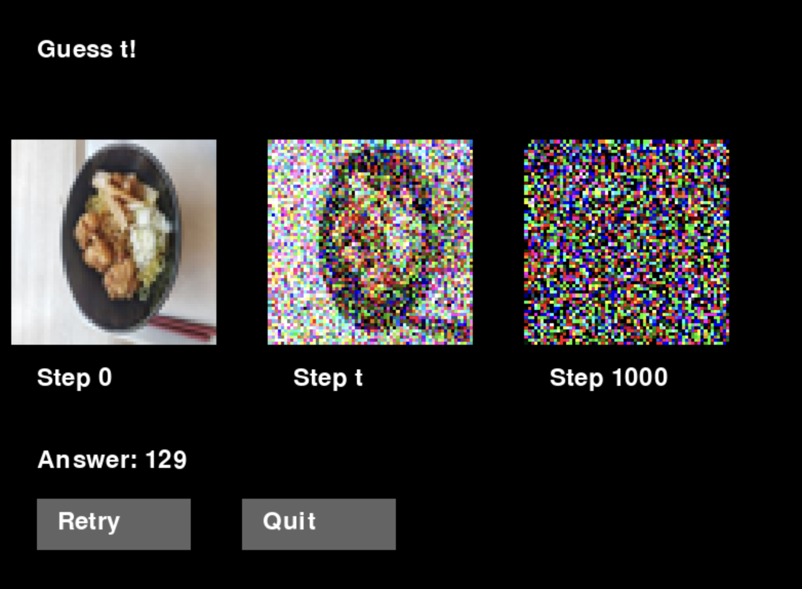

# Noise Guesser
> **The English version of the README is bellow the Japanese one**

# README (JA)
Noise Guesserは拡散モデルの拡散過程において、与えられた画像からステップを推測するゲームです。

## プレイ方法
### ipynb
`NoiseGuesser.ipynb` を実行
### pygame
`start_game.py` を実行

## 謝辞
[ゼロから作るDeep Learning ❺ ―生成モデル編](https://www.oreilly.co.jp/books/9784814400591/)を参考にさせて頂きました。

# README　(EN)
Noise Guesser is a game where you guess the number of steps in the noising process of a diffusion model from a given image.

## How to Play
First, please install the packages listed in `requirements.txt`.
### ipynb
Run
`NoiseGuesser.ipynb`.
### pygame
Run `start_game.py`.

## Acknowledgements
I referenced [ゼロから作るDeep Learning ❺ ―生成モデル編](https://www.oreilly.co.jp/books/9784814400591/).