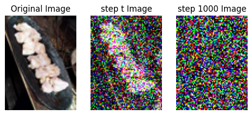

# Noise Guesser
**The English version of the README is coming soon.**

# 日本語README
noise guesserは拡散モデルの拡散過程において、与えられた画像からステップを推測するゲームです。




## パッケージ
このゲームに必要なパッケージは以下の通りです。
```
numpy
pillow
matplotlib
```

## プレイ方法
現時点ではipynbでのプレイのみがサポートされています。

`NoiseGuesser.ipynb`を実行してプレイしてください。

## To Do
- [ ]  English versionのREADMEを作る
- [ ]  pygameにて実装する
- [ ]  ウェブアプリとして実装する

## 謝辞
[ゼロから作るDeep Learning ❺ ―生成モデル編](https://www.oreilly.co.jp/books/9784814400591/)を参考にさせて頂きました。
